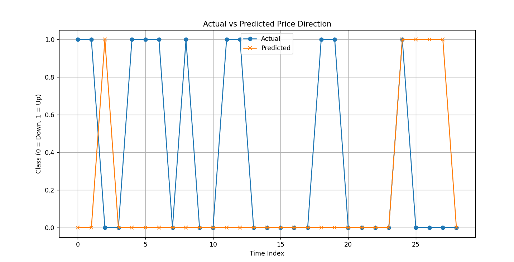

# 📈 Reliance Stock Price Direction Predictor using Random Forest

A machine learning project that predicts whether **Reliance stock price** will go **up or down the next day** using recent historical OHLCV data and engineered technical indicators. The model is trained using **Random Forest Classifier** with **GridSearchCV** optimization and a custom scoring function for balanced recall.

---

## 🚀 Overview

This project attempts to model stock price *direction* rather than exact value, framing the problem as **binary classification**:

- `0` → Price goes **down**
- `1` → Price goes **up**

Despite challenges due to class imbalance and market noise, this model uses several handcrafted features and hyperparameter tuning to improve performance.

---

## 🔧 Features Used

The following features were extracted from OHLCV data for Reliance:

- Raw data:
  - `Open`, `High`, `Low`, `Close`, `Volume`
- Lag features:
  - `Close_t-1`, `Volume_t-1`
- Technical indicators:
  - `Close_MA_5`, `Close_MA_10`, `Close_STD_5`
  - `Daily_Return`, `Volume_Change`
- Date-based:
  - `Day_of_Week`

---

## 📊 Model Details

- **Model**: `RandomForestClassifier` from `sklearn`
- **Tuning**: `GridSearchCV` (3-fold)
- **Scoring**: Custom `balanced_recall_score()` to reward correct predictions on both classes
- **Hyperparameters tuned**:
  - `n_estimators`
  - `max_depth`
  - `min_samples_leaf`
  - `min_samples_split`
  - `class_weight`

---

## 📁 Folder Structure
```
reliance-stock-rf-classifier/
├── data/
│   ├── X.pkl
│   └── y.pkl
│
├── models/
│   ├── rf_model.pkl
│   └── rf_model_tuned.pkl
│
├── notebooks/
│   ├── exploratory_analysis.ipynb
│   └── RELIANCE_stock_data.xlsx
│
├── src/
│   ├── __pycache__/
│   ├── data_normalization.py
│   ├── data_preprocessing.py
│   ├── feature_engineering.py
│   ├── imports.py
│   ├── model_predictions.py
│   ├── model_training.py
│   ├── utils.py
│   └── requirements.txt
│
├── README.md
```


Classification Report:

| Class | Precision | Recall | F1-Score | Support |
|-------|-----------|--------|----------|---------|
|   0   |   0.58    |  0.78  |   0.67   |   18    |
|   1   |   0.20    |  0.09  |   0.12   |   11    |

**Accuracy**: 52%  
**Macro Avg F1**: 0.40

> 🔍 The model is currently more sensitive to class `0` (price down). Future work includes improving recall on class `1`.

Visual Output:  


---

## 📦 Installation

### Step 1: Clone the repo
```bash
git clone https://github.com/yourusername/reliance-stock-rf-classifier.git
cd reliance-stock-rf-classifier

